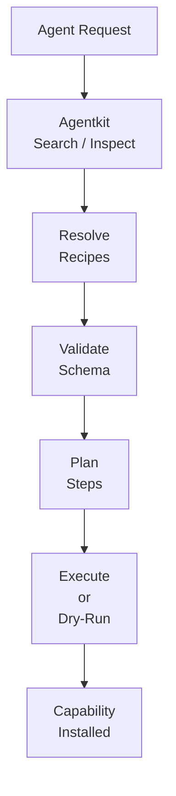

# Overview

AgentKit is a **capability package manager** for AI coding agents. It turns “guess and check” installs into deterministic, reusable recipes.

:::note TL;DR
AgentKit helps agents install **capabilities** (not just packages) using declarative, multi‑step recipes.
:::

**Think:** brew/npm for *capabilities*, not just binaries.

## What it is
- A **CLI** for `search`, `inspect`, and `add`
- A **recipe engine** for deterministic installs
- A **GitHub‑native registry** of capabilities

## What it is not
- Not an agent runtime
- Not a chatbot
- Not an MCP replacement

## Mental model
- **MCP** lets agents *use* tools at runtime
- **AgentKit** lets agents *install* and *configure* capabilities ahead of time

A **capability** is a usable workflow, not just a package: it can include installs, configs, downloads, safety checks, and validation steps.

## Why it matters

**Multi‑step workflows beat single installs.** AgentKit chains steps (download → extract → configure → validate) so agents stop guessing and start executing.

Agents burn tokens when they guess tooling. AgentKit makes installs repeatable, transparent, and safe for automation.

## Example
```bash
agentkit add web-automation --dry-run --json
```
Returns a plan with resolved recipes, steps, and changes.

## How it works (flow)


